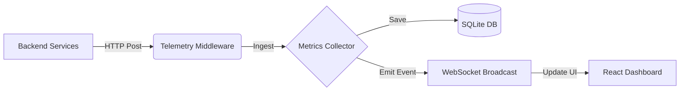

---

# 🚀 Metric Heartbeat

**Real-Time API Observability & Telemetry Dashboard**

**Metric Heartbeat** is a lightweight, real-time observability system designed to monitor backend APIs. It provides live metrics, latency tracking, error rates, and service-level filtering via a unified dashboard.

Think of it as a **mini Datadog or Grafana** tailored specifically for Node.js microservices, built with **Socket.IO, React, and SQLite**.

---

## ✨ Key Features

* ✅ **Real-time Monitoring:** Live telemetry streaming via Socket.IO.
* ✅ **Multi-Service Support:** Filter metrics by specific backend services.
* ✅ **Live Logs:** View incoming HTTP requests as they happen.
* ✅ **Latency Visualization:** Real-time graphs for response time performance.
* ✅ **Error Tracking:** Instant visibility into 4xx and 5xx error rates.
* ✅ **Auto-Discovery:** New services appear automatically upon connection.
* ✅ **Non-Blocking:** Fire-and-forget middleware ensures zero impact on API performance.

---

## 🧠 Architecture

Data flows from your backend services through the middleware to the collector, which broadcasts updates to the dashboard.



---

## 📦 Project Structure

```text
metric-heartbeat/
│
├── collector/       # Node.js + Express + Socket.IO server (The Brain)
├── dashboard/       # React + Vite frontend (The UI)
├── middleware/      # Reusable telemetry capture logic
└── README.md        # Documentation

```

---

## ⚙️ Prerequisites

* **Node.js** (v18 or higher recommended)
* **npm** or **pnpm**
* **Git**

---

## 🔥 Getting Started

Follow these steps to get the system running locally.

### 1️⃣ Clone the Repository

```bash
git clone <your-repo-url>
cd metric-heartbeat

```

### 2️⃣ Start the Collector (Backend)

The collector receives metrics and manages the database.

```bash
cd collector
npm install
npm start

```

> **Output:** `Metrics Collector Server Running on http://localhost:3002`

### 3️⃣ Start the Dashboard (Frontend)

Open a new terminal window:

```bash
cd dashboard
npm install
npm run dev

```

> **Visit:** `http://localhost:5173` (or the port shown in your terminal).

---

## 🔌 Integration: Connecting Your Backend

To monitor an API, you simply add a middleware function that intercepts the response "finish" event and sends data to the collector.

### Copy-Paste Middleware

Add this to your Express.js app (before your routes):

```javascript
// telemetry.js or inside app.js
const COLLECTOR_URL = "http://localhost:3002/api/metrics";

const telemetryMiddleware = (req, res, next) => {
  const start = Date.now();

  res.on("finish", async () => {
    const responseTime = Date.now() - start;

    try {
      // Fire and forget - do not await this to prevent blocking response
      fetch(COLLECTOR_URL, {
        method: "POST",
        headers: { "Content-Type": "application/json" },
        body: JSON.stringify({
          route: req.originalUrl,
          method: req.method,
          status: res.statusCode,
          responseTime,
          isError: res.statusCode >= 400,
          service: process.env.SERVICE_NAME || "unknown-service" // Critical
        })
      }).catch(err => console.error("Telemetry Error:", err.message));
    } catch (e) {
      // Fail silently to never crash the main app
    }
  });

  next();
};

app.use(telemetryMiddleware);

```

---

## ⭐ Configuration

### Naming Your Services

Observability relies on identity. **Never rely on port numbers** to identify your services. Use Environment Variables.

**In your backend's `.env` file:**

```bash
SERVICE_NAME=orders-api

```

**Or run inline:**

```bash
SERVICE_NAME=payments-api node server.js

```

> **Result:** The dashboard dropdown will automatically populate with `orders-api` or `payments-api`.

---

## 🧩 Collector API Reference

The Collector runs on port `3002` by default.

| Endpoint | Method | Description |
| --- | --- | --- |
| `/health` | GET | Check if collector is alive. |
| `/api/services` | GET | List all active/discovered services. |
| `/api/metrics` | POST | Ingest new telemetry data. |
| `/api/metrics/summary` | GET | Get aggregated stats (Total requests, Error rate). |
| `/api/metrics/routes` | GET | detailed analytics per route. |
| `/api/metrics/latency` | GET | Time-series data for latency graphs. |
| `/api/metrics/export` | GET | Fetch recent raw logs. |

---

## 🚨 Best Practices

1. **Logical Naming:** Use clear names like `auth-service`, `payment-gateway`, `notification-worker`. Avoid `server-1` or `test-app`.
2. **Safety First:** Ensure your telemetry code is wrapped in `try/catch`. Monitoring code should **never** crash your production application.
3. **Environment Variables:** Always use `process.env.SERVICE_NAME` to keep your middleware reusable across different microservices.

---

## 🗺️ Roadmap & Future Improvements

Looking to contribute or extend the project? Here are some high-impact engineering goals:

* [ ] **Docker Support:** Containerize the Collector and Dashboard.
* [ ] **Authentication:** Secure the dashboard with a login.
* [ ] **Alerting:** Integrate Slack/Discord webhooks for high error rates.
* [ ] **Request Tracing:** Generate a `trace-id` to follow requests across microservices.
* [ ] **Persistence:** Swap SQLite for PostgreSQL or InfluxDB for heavy loads.
* [ ] **Prometheus:** Expose an endpoint for Prometheus scraping.

---

## 💡 Engineering Philosophy

**Metric Heartbeat** demonstrates concepts beyond simple CRUD apps:

* **Distributed Systems:** Handling data from multiple independent sources.
* **Event-Driven Architecture:** Using WebSockets for live state updates.
* **Resiliency:** Designing middleware that degrades gracefully.

---

## 👨‍💻 Author

**Royal D Souza**
*Building systems that observe systems ⚡*